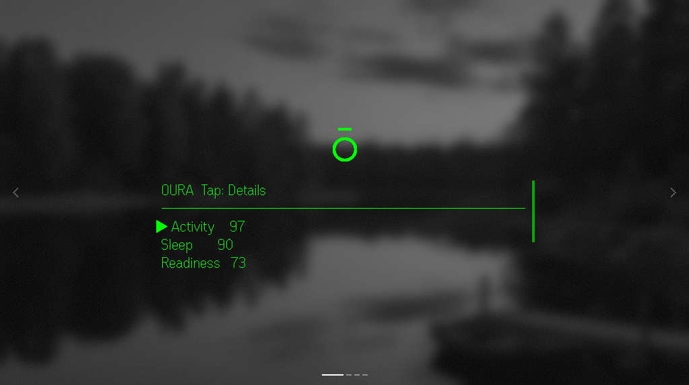
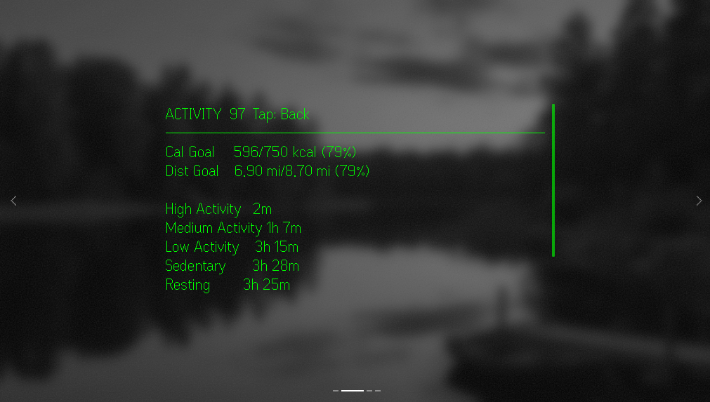
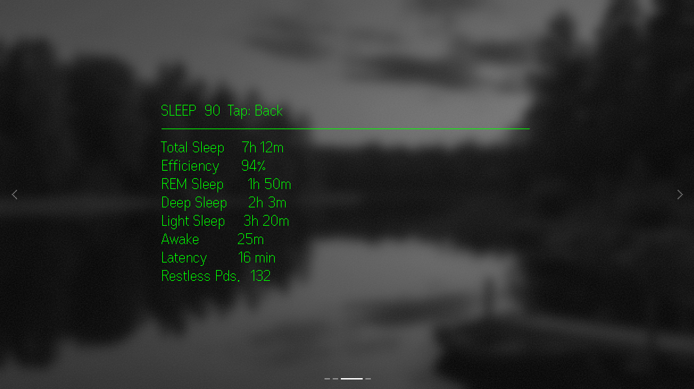
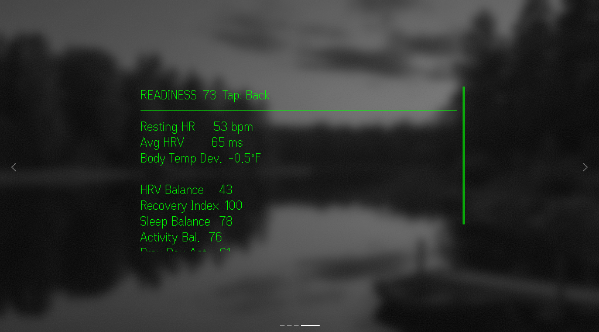

# Oura Glance G2

A G2 smart glasses app built with [even-toolkit](https://www.npmjs.com/package/even-toolkit) that surfaces [Oura Ring](https://ouraring.com) Readiness, Sleep, and Activity data — right on the glasses and in a companion phone-app view.

## Features

- Activity, Sleep, and Readiness scores on the glasses home screen, with drill-down detail screens showing raw units (heart rate, HRV, sleep stage durations, calories, steps, distance) instead of just the 0–100 score
- Goal progress (active calories / distance vs. target) for Activity
- Imperial/Metric unit toggle (distance and temperature deviation)
- Modern iOS-style companion phone app for managing an Oura token and unit preference

## Screenshots

| Home | Activity | Sleep | Readiness |
|---|---|---|---|
|  |  |  |  |

## Installation

Oura Glance isn't listed on the official Even Hub store yet, so it's distributed as a sideloaded package:

1. Download the latest `oura-glance-g2.ehpk` from [**GitHub Releases**](https://github.com/tylermsellers/oura-glance-g2/releases/latest) onto your phone.
2. In the Even Realities companion app, use the sideload/developer-install option to import the file.

The app runs entirely from the installed bundle plus a hosted Cloudflare Worker API proxy — no PC, dev server, or shared Wi-Fi network required after install.

Once installed, open the app on your phone and tap **Connect with Oura** in the Connection section. This opens Oura's sign-in/consent page in your browser; approve access and return to the app — it finishes connecting automatically. (Oura retired Personal Access Tokens, so this OAuth2 flow is now the only supported auth method.)

## Development

```bash
npm install
npm run dev
```

Open [http://localhost:5173](http://localhost:5173) in your browser.

### Test with the simulator

```bash
npx @evenrealities/evenhub-simulator@latest http://localhost:5173
```

### Sideload while developing (QR code)

With `npm run dev` running, generate a QR code pointing at the local dev server:

```bash
npx evenhub qr
```

Scan it with the Even Realities companion app (phone and dev machine must be on the same Wi-Fi network). The app loads onto the G2 glasses with hot reload. This flow is only for local development/testing — it requires the dev server to keep running.

### Build & package

```bash
npm run build
npx @evenrealities/evenhub-cli pack app.json dist -o oura-glance-g2.ehpk
```

This produces `oura-glance-g2.ehpk`, attached to [GitHub Releases](https://github.com/tylermsellers/oura-glance-g2/releases) for manual sideloading (see Installation above). No review is required for this distribution method.

## License

Personal project — not officially affiliated with Oura Health Oy or Even Realities.
